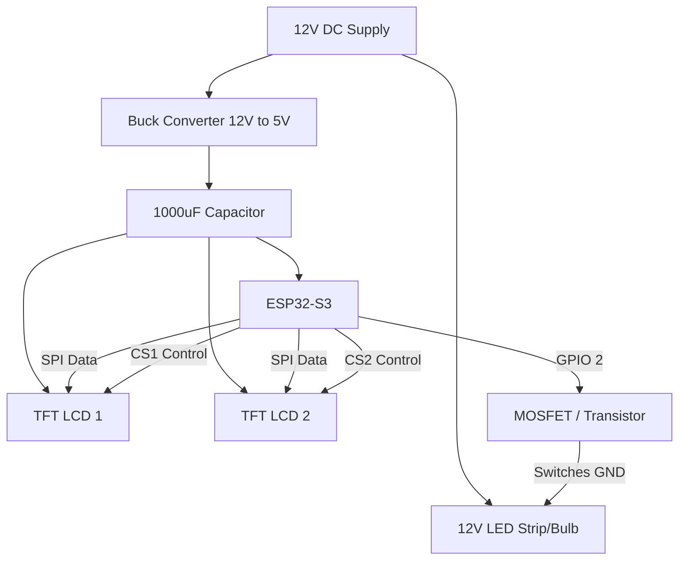

# Hardware Wiring & Power Diagram

This plan provides the complete electrical and logical flow for your upgraded hardware setup.

## User Review Required

> [!IMPORTANT]
> - **12V LED Control**: ESP32 pins are **3.3V only**. To control 12V LEDs, you MUST use a **MOSFET** (like an IRFZ44N) or a power transistor. Connecting 12V directly to an ESP32 pin will destroy the chip.
> - **Common Ground**: You must connect the GND of your 12V supply, the Buck Converter, and the ESP32 together for the signals to work.
> - **Capacitor Placement**: The 1000µF capacitor should be placed at the **Output of the Buck Converter** (5V line) to handle the power spikes when the screens and WiFi are active.

## Proposed Components & Flow

### Power Architecture
1.  **12V DC Input**:
    - Connect to **Buck Converter IN+**.
    - Connect to **LED (+) Rail**.
2.  **Buck Converter (5V Output)**:
    - Connect to **ESP32-S3 5V/Vin pin**.
    - Connect to **TFT 1 VCC** and **TFT 2 VCC**.
    - Connect the **1000uF Capacitor** across 5V and GND.
3.  **12V LED Control**:
    - **ESP32 Pin 2** (or dynamic pin) -> Resistor -> MOSFET Gate.
    - MOSFET Drain -> 12V LED (-).
    - 12V LED (+) -> 12V Supply (+).

### Data Connections (SPI)
Both screens share the data lines but have unique Chip Select (CS) pins.

| Component | Pin Function | ESP32-S3 Pin |
| :--- | :--- | :--- |
| **Both Screens** | SCK (Clock) | **GPIO 12** |
| **Both Screens** | MOSI (Data In) | **GPIO 11** |
| **Both Screens** | MISO (Data Out) | **GPIO 13** |
| **Both Screens** | DC (Data/Cmd) | **GPIO 9** |
| **Both Screens** | RST (Reset) | **GPIO 8** |
| **Screen 1 Only** | CS (Image) | **GPIO 10** |
| **Screen 2 Only** | CS (Details) | **GPIO 14** |

## Visual Diagram (Flow)

## Verification Plan

### Manual Verification
1.  **Voltage Check**: Before connecting the ESP32, use a multimeter to ensure the Buck Converter output is exactly **5V**.
2.  **SPI Test**: Run a "Hello World" test for both screens to verify the CS pins are correctly switching.
3.  **Power Stability**: Verify the screens do not flicker or reboot when the LEDs turn on (ensuring the capacitor is doing its job).
