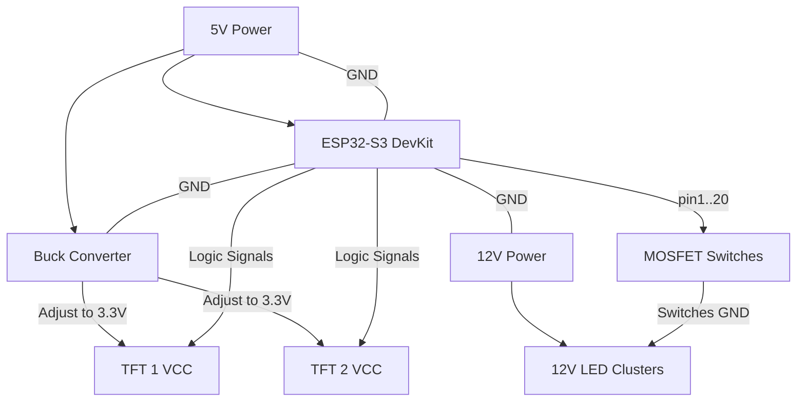

# 🛡️ Tri-Voltage Power & Pinout Guide (Final)

This configuration achieves the best isolation. Your high-power 12V LEDs are completely separated from your logic and screens, ensuring no flickering or noise.

---

## ⚡ Tri-Voltage Power Architecture

| Supply Type | Voltage | Connection Target | Purpose |
| :--- | :--- | :--- | :--- |
| **Supply A** | **12V DC** | **- 12V LED Rails (+)** | High-Power Lighting only |
| **Supply B** | **5V DC** | **- ESP32 5V Pin**   **- Buck Converter IN (+)** | Main Logic Power |
| **Buck Conv** | **3.3V OUT** | **- Both Screen VCC & LED pins** | **Set to exactly 3.3V** |

> [!IMPORTANT]
> **COMMON GROUND**: You must join the negative (-) wires of the 12V Supply, 5V Supply, Buck Converter, and ESP32 GND together.

---

## 🖥️ Screen Data (Non-Conflict Range)

We are using high-range pins to avoid any internal conflicts (Skipping 6 - 11).

| Feature | Screen 1 (Image) | Screen 2 (Details) | Note |
| :--- | :--- | :--- | :--- |
| **VCC / LED** | **3.3V (Buck)** | **3.3V (Buck)** | **Powered by Buck (from 5V)** |
| **GND** | **System GND** | **System GND** | Shared Ground |
| **CS** (Chip Select) | **GPIO 44** | **GPIO 14** | Primary Screen Select |
| **DC / RS** | **GPIO 21** | **GPIO 17** | Independent Logic |
| **RESET** | **GPIO 8** | **GPIO 18** | Independent Reset |
| **SCK** (Clock) | **GPIO 12** | **GPIO 12** | shared Data Highway |
| **MOSI** (Data) | **GPIO 43** | **GPIO 43** | shared Data Highway |

---

## 📟 Product LED Pin Mapping (12V Control)

These pins trigger the MOSFETs to switch the 12V ground for your lamps.

| Product Name | ESP32-S3 Pin | physical Lamp |
| :--- | :--- | :--- |
| **GAINEXA** | **GPIO 1** | 12V LED Group |
| **CENTURION EZ** | **GPIO 2** | 12V LED Group |
| **ELECTRON** | **GPIO 3** | 12V LED Group |
| **TRISKELE** | **GPIO 4** | 12V LED Group |
| **KEVUKA / ZEVIGO** | **GPIO 5** | 12V LED Group |
| **TRIDIUM** | **GPIO 15** | 12V LED Group |
| **ARGYLE** | **GPIO 16** | 12V LED Group |
| **BRUCIA** | **GPIO 19** | 12V LED Group |
| **LARVIRON** | **GPIO 20** | 12V LED Group |

---

## 📐 Final Wiring Diagram

**Everything is now perfectly isolated. Your logic runs on 5V, your screens on 3.3V, and your diorama on 12V!**
