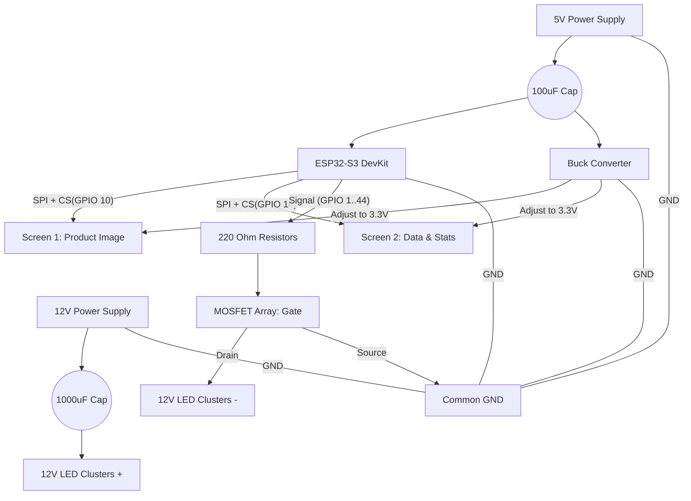

# 🛡️ Tri-Voltage Power & Pinout Guide (Final)

This configuration achieves the best isolation. Your high-power 12V LEDs are completely separated from your logic and screens, ensuring no flickering or noise.

---

## ⚡ Tri-Voltage Power Architecture

| Supply Type | Voltage | Connection Target | Purpose |
| :--- | :--- | :--- | :--- |
| **Supply A** | **12V DC** | **- 12V LED Rails (+)** | High-Power Lighting only |
| **Supply B** | **5V DC** | **- ESP32 5V Pin**   **- Buck Converter IN (+)** | Main Logic Power |
| **Buck Conv** | **3.3V OUT** | **- Both Screen VCC & LED pins** | **Set to exactly 3.3V** |

> [!IMPORTANT]
> **COMMON GROUND**: You must join the negative (-) wires of the 12V Supply, 5V Supply, Buck Converter, and ESP32 GND together.

---

## 🖥️ Master Pinout Table (ESP32-S3)

The dual screens share the data highway (SPI) but use separate chip-selects.

| Feature | Shared / Common | Screen 1 (Visual) | Screen 2 (Data) |
| :--- | :--- | :--- | :--- |
| **SCK (Clock)** | **GPIO 12** | — | — |
| **MOSI (Data)** | **GPIO 11** | — | — |
| **MISO** | **GPIO 13** | — | — |
| **CS (Select)** | — | **GPIO 10** | **GPIO 14** |
| **DC (Logic)** | — | **GPIO 21** | **GPIO 17** |
| **RESET** | — | **GPIO 38** | - |

---

## 💡 Product LED Activation Pins (Dynamic)

| Product Name | 5V ESP Pin | Target Crops | 12V Crop Pins |
| :--- | :--- | :--- | :--- |
| **GAINEXA** | 1 | PADDY / VEGETABLE | 2, 3 |
| **CENTURION EZ** | 4 | JUTE | 5 |
| **ELECTRON** | 6 | VEGETABLE | 7 |
| **TRISKELE** | 8 | SUGARCANE | 9 |
| **KEVUKA / ZEVIGO** | 15 | PADDY | 16 |
| **TRIDIUM** | 33 | PADDY / POTATO / VEGETABLE | 34, 35, 36 |
| **ARGYLE** | 37 | VEGETABLE / PADDY | 38, 39 |
| **BRUCIA** | 40 | MAIZE | 41 |
| **LARVIRON** | 42 | PADDY | 44 |

---

## 📐 Circuit Blueprint (Tri-Voltage)

---

## ⚙️ Component Specifications

| Component | Recommended Value | Connection Tip |
| :--- | :--- | :--- |
| **MOSFET** | **IRFZ44N** (N-Channel) | Drain to LED (-), Source to GND |
| **Smoothing Cap** | **1000 µF (12V) / 100 µF (5V)** | Watch polarity (Stripe to GND) |
| **Gate Resistor** | **220 Ω** | Place between ESP Pin & MOSFET Gate |
| **Buck Converter** | **LM2596** | **CRITICAL**: Set to 3.3V before connecting screens |

**Everything is now perfectly isolated. Your logic runs on 5V, your screens on 3.3V, and your diorama on 12V!**
