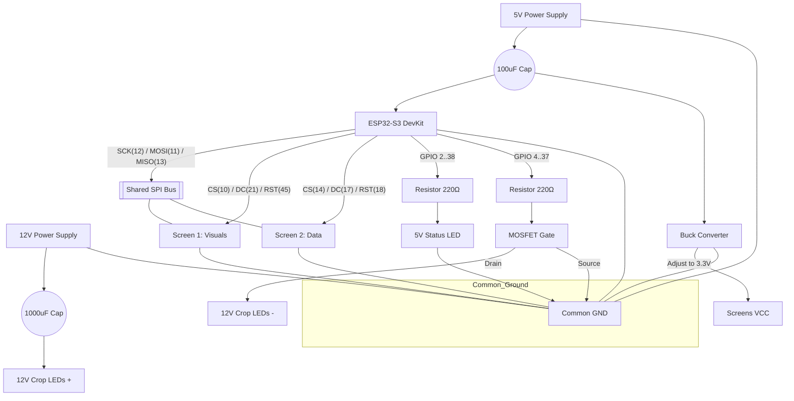

# 🛡️ Tri-Voltage Power & Pinout Guide (Final)

This configuration achieves the best isolation. Your high-power 12V LEDs are completely separated from your logic and screens, ensuring no flickering or noise.

---

## ⚡ Tri-Voltage Power Architecture

| Supply Type | Voltage | Connection Target | Purpose |
| :--- | :--- | :--- | :--- |
| **Supply A** | **12V DC** | **- 12V LED Rails (+)** | High-Power Lighting only |
| **Supply B** | **5V DC** | **- ESP32 5V Pin**   **- Buck Converter IN (+)** | Main Logic Power |
| **Buck Conv** | **3.3V OUT** | **- Both Screen VCC & LED pins** | **Set to exactly 3.3V** |

---

## 🔌 Where to connect the 12V+ Plug?

The 12V positive wire from your adapter **NEVER** touches the ESP32. It only goes to the LEDs:

1.  **Main 12V+ Rail**: Connect the **Positive (+)** wire from your 12V adapter to a common terminal block or rail.
2.  **To LED Clusters**: Connect the **Positive (+)** side of EVERY 12V LED cluster directly to this 12V Rail.
3.  **To MOSFETs**: **NOTHING**. The 12V+ never touches the MOSFET pins. (The MOSFETs only control the Negative/- side of the circuit).

> [!CAUTION]
> **Safety Check**: Ensure the 12V+ wire never touches the ESP32 pins or the 5V power supply. This will permanently damage the microcontroller.

> [!IMPORTANT]
> **COMMON GROUND**: You must join the negative (-) wires of the 12V Supply, 5V Supply, Buck Converter, and ESP32 GND together.

---

## 🖥️ Master Pinout Table (ESP32-S3)

The dual screens share the data highway (SPI) but use separate chip-selects.

| Feature | Shared / Common | Screen 1 (Visual) | Screen 2 (Data) |
| :--- | :--- | :--- | :--- |
| **SCK (Clock)** | **GPIO 12** | — | — |
| **MOSI (Data)** | **GPIO 11** | — | — |
| **MISO** | **GPIO 13** | — | — |
| **CS (Select)** | — | **GPIO 10** | **GPIO 14** |
| **DC (Logic)** | — | **GPIO 21** | **GPIO 17** |
| **RESET** | — | **GPIO 47** | **GPIO 48** |

---

## 💡 Product LED Activation Pins (Dynamic)

| Product Name | 5V ESP Pin | Target Crops | 12V Crop Pins |
| :--- | :--- | :--- | :--- |
| **GAINEXA** | 2 | PADDY / VEGETABLE | 4, 5 |
| **CENTURION EZ** | 6 | JUTE | 7 |
| **ELECTRON** | 8 | VEGETABLE | 5 |
| **TRISKELE** | 9 | SUGARCANE | 15 |
| **KEVUKA / ZEVIGO** | 16 | PADDY | 4 |
| **TRIDIUM** | 33 | PADDY / POTATO / VEGETABLE | 4, 34, 5 |
| **ARGYLE** | 35 | VEGETABLE / PADDY | 5, 4 |
| **BRUCIA** | 36 | MAIZE | 37 |
| **LARVIRON** | 38 | PADDY | 4 |

---

## 🌾 Crop Master Pin Table (Diorama Areas)

| Crop Name | Logic Pin (12V Rail) | Physical Layer |
| :--- | :--- | :--- |
| **PADDY** | **GPIO 4** | Field A |
| **VEGETABLE** | **GPIO 5** | Field B |
| **JUTE** | **GPIO 7** | Field C |
| **SUGARCANE** | **GPIO 15** | Field D |
| **POTATO** | **GPIO 34** | Field E |
| **MAIZE** | **GPIO 37** | Field F |

---

## 📐 Circuit Blueprint (Tri-Voltage)

---

## ⚙️ Component Specifications

| Component | Recommended Value | Connection Tip |
| :--- | :--- | :--- |
| **MOSFET** | **IRFZ44N** (N-Channel) | Drain to LED (-), Source to GND |
| **Smoothing Cap** | **1000 µF (12V) / 100 µF (5V)** | Watch polarity (Stripe to GND) |
| **Gate Resistor** | **220 Ω** | Place between ESP Pin & MOSFET Gate |
| **Buck Converter** | **LM2596** | **CRITICAL**: Set to 3.3V before connecting screens |

---

## 🛠️ MOSFET Pinout (IRFZ44N)

When looking at the MOSFET from the front (label facing you):

| Pin Name | Position | Connect To... | Purpose |
| :--- | :--- | :--- | :--- |
| **GATE (G)** | **Left (1)** | **ESP32 GPIO Pin** (via 220Ω Resistor) | ON/OFF Signal from ESP32 |
| **DRAIN (D)** | **Middle (2)** | **LED Cluster (-) Negative wire** | Connects LEDs to the switch |
| **SOURCE (S)** | **Right (3)** | **Common GROUND / Adapter (-) wire** | Path back to Power Supply |

> [!TIP]
> **Floating Gate Fix**: Add a 10kΩ resistor between **GATE** and **GND**. This ensures the LEDs stay OFF when the ESP32 is rebooting.

**Everything is now perfectly isolated. Your logic runs on 5V, your screens on 3.3V, and your diorama on 12V!**
