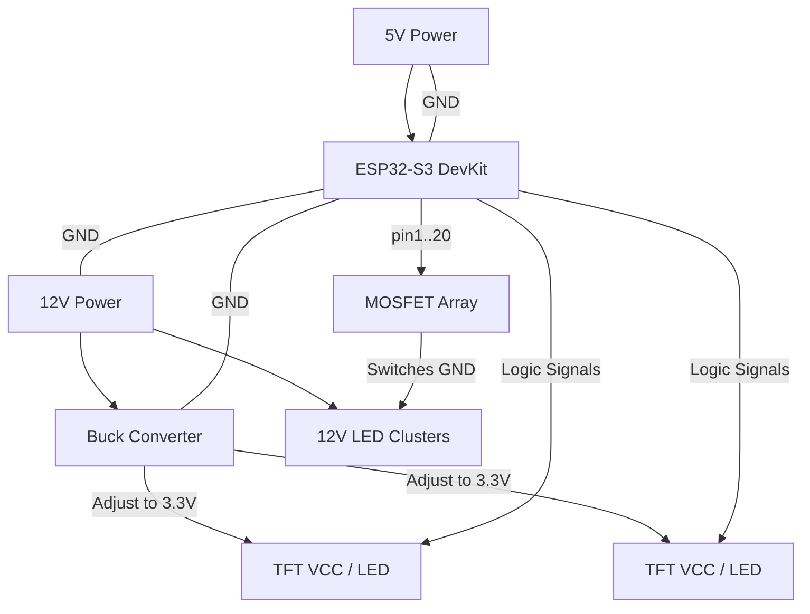

# 🛡️ Dual-Power Master Hardware Guide (Final)

To ensure maximum stability and protect your ESP32-S3 from overheating, we are using a **Dual-Power Supply** architecture. This setup keeps the high-power LEDs and screens completely separate from the ESP32 logic.

---

## ⚡ Power Supply Architecture

| Supply Type | Voltage | Connection Target | Purpose |
| :--- | :--- | :--- | :--- |
| **Supply A** | **12V DC** | **- Buck Converter IN (+/-)** **- 12V LED Rails (+)** | Power for Dioramas & Screens |
| **Supply B** | **5V DC** | **- ESP32 5V & GND Pins** | Power for ESP32 Logic |
| **Buck Conv** | **3.3V OUT** | **- Both Screen VCC & LED pins** | **Set screw to exactly 3.3V** |

> [!CAUTION]
> **COMMON GROUND**: You MUST connect the Negative/GND wires of the 12V Supply, the 5V Supply, the Buck Converter Output, and the ESP32 together. Without a shared ground, the screens will not work.

---

## 🖥️ Screen Data (Non-Conflict Range)

We are using high-range pins to avoid any internal conflicts (Skipping 6 - 11).

| Feature | Screen 1 (Image) | Screen 2 (Details) | Note |
| :--- | :--- | :--- | :--- |
| **VCC / LED** | **3.3V (Buck)** | **3.3V (Buck)** | **Powered by Buck Converter** |
| **GND** | **System GND** | **System GND** | Shared Ground |
| **CS** (Chip Select) | **GPIO 44** | **GPIO 14** | Primary Screen Select |
| **DC / RS** | **GPIO 21** | **GPIO 17** | Independent Logic |
| **RESET** | **GPIO 45** | **GPIO 18** | Independent Logic |
| **SCK** (Clock) | **GPIO 12** | **GPIO 12** | Shared Data Highway |
| **MOSI** (Data) | **GPIO 43** | **GPIO 43** | Shared Data Highway |

---

## 📟 Product LED Pin Mapping (12V Control)

| Product Name | ESP32-S3 Pin | physical Lamp |
| :--- | :--- | :--- |
| **GAINEXA** | **GPIO 1** | 12V LED Cluster |
| **CENTURION EZ** | **GPIO 2** | 12V LED Cluster |
| **ELECTRON** | **GPIO 3** | 12V LED Cluster |
| **TRISKELE** | **GPIO 4** | 12V LED Cluster |
| **KEVUKA / ZEVIGO** | **GPIO 5** | 12V LED Cluster |
| **TRIDIUM** | **GPIO 15** | 12V LED Cluster |
| **ARGYLE** | **GPIO 16** | 12V LED Cluster |
| **BRUCIA** | **GPIO 19** | 12V LED Cluster |
| **LARVIRON** | **GPIO 20** | 12V LED Cluster |

---

## 📐 Final Wiring Diagram

**This is the safest and most professional configuration. Your ESP32 will run cool and your screens will be bright and stable!**
